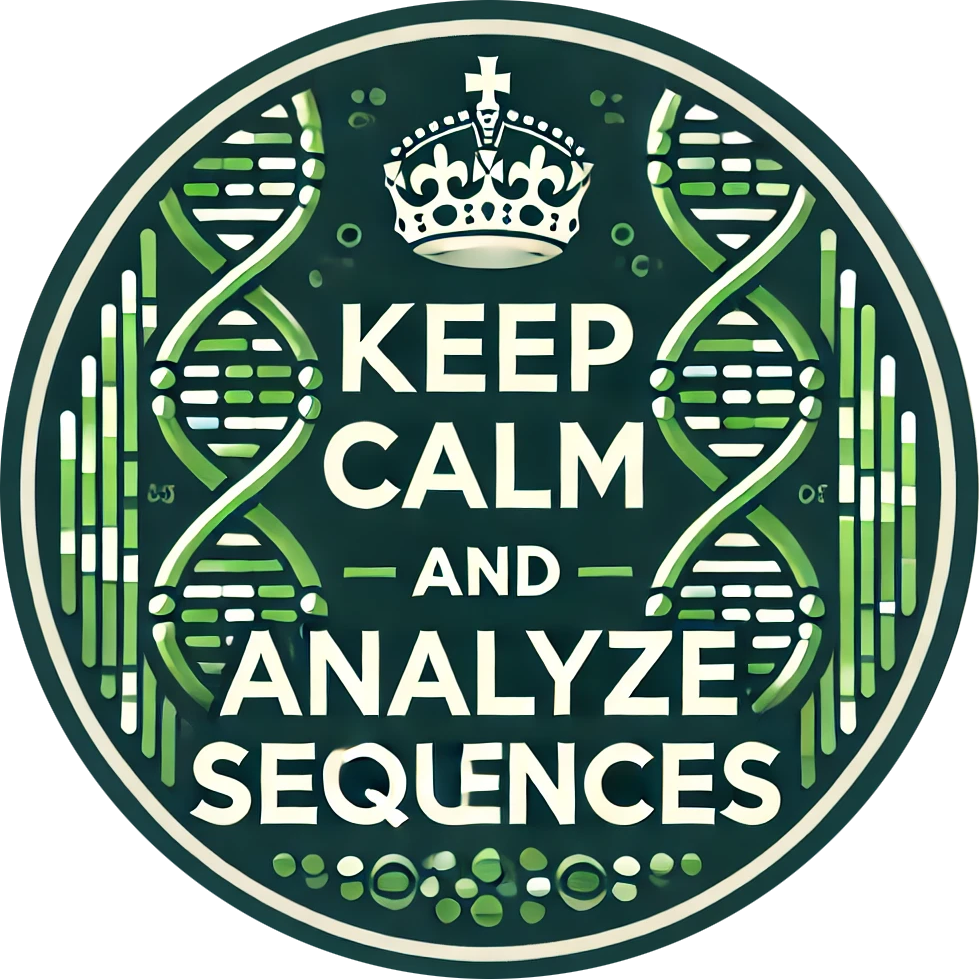

# Sequence_analyzer
| Sequence_analyzer - is a toolkit for working with DNA/RNA sequences and fastq sequences. The tool performs RNA/DNA sequences processing as well as fastq sequences filtering depending on the input criteria. |  |
|:--------------------------------------------------------|:-------------------------------------------------------:|

Author:  
**Software, Idea, Testing**: [*Bulat Rakhimov*](https://t.me/bulatych_7)  
## Content
- [Description](##description)
- [Installation](##Installation)
- [Examples](##Examples)
- [FAQ](##FAQ)
- [Contact](##contact)
## Description
The **Sequence_analyzer** toolkit includes the following key features:
- **run_dna_rna_tools**: Analyze and manipulate DNA and RNA sequences. It works with additional modules that allow to perform the following operations: transcribing a sequence, returning a reverse sequence, finding a complementary chain and returning a reverse complementary sequence.
- **filter_fastq**: Filter FASTQ sequences based on various criteria including GC content, sequence length, and quality thresholds.  The function works on the fly, accepts a fastq file,
    selects sequences for recording and saves the filtered data. Functions checks the existence of output directory and if missing creates a folder "filtered"

The toolkit is designed to improve genomic data processing, making it accessible for both beginners and experienced users.
## Installation

To use the Sequence_analyzer toolkit, follow these steps:

1. Clone the repository:
   ```bash
   git clone git@github.com:bulatych/Sequence_analyzer_tools.git
   cd Sequence_analyzer_tools
   python Sequence_analyzer.py 
## Examples
The `filter_fastq` function allows you to filter sequences based on specified criteria. Function accepts 5 arguments as input
The function works on the fly, accepts a fastq file, selects sequences for recording and saves the filtered data. Functions
checks the existence of output directory and if missing creates. Here’s an example of how to use it:
```python
from Sequence_analyzer import filter_fastq
from additional_modules.filter_fastq import (
    is_length_bounds,
    gc_content_calculator,
    calc_quality,check_quality,
    check_length,
    check_gc_content)

# Parameteres
gc_bounds = (0, 20)          
length_bounds = (0, 100)         
quality_threshold = 30
filter_fastq("example_fastq.fastq", "filtered_fastq.fastq", (0, 20), (0, 100), 30)
```

The `run_dna_rna_tools` function allows to process sequences based on procedure
``` python
from Sequence_analyzer import run_dna_rna_tools
from additional_modules.dna_rna_tools import (seq_transcr, seq_reverse, seq_compl, seq_rev_compl, is_valid_sequence)

results = run_dna_rna_tools(*args)
*seqs, procedure = args
```

The ``
## FAQ
**1. What is the purpose of the Sequence_analyzer toolkit?**  
The toolkit is designed to assist researchers in analyzing and filtering genomic data efficiently. It offers functions for processing DNA/RNA and FASTQ sequences, making data handling easier.

**2. Can I use this toolkit for other sequencing formats?**  
Currently, the toolkit is focused on DNA/RNA and FASTQ sequences. Support for other formats may be added in future releases.


## Contact
Please report any problems directly to the [GitHub](https://github.com/bulatych).  
Also, you can send your feedback to rah.bulat7@yandex.ru.

